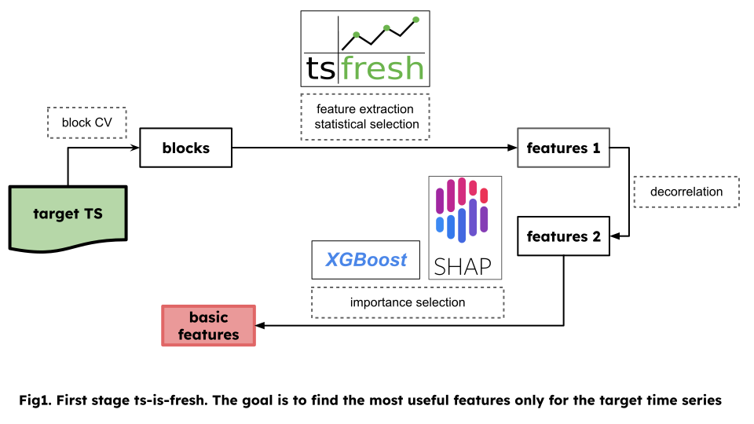

Algorithm
=========

Preprocessing
-------------

First of all, for ease of working with time series, we **quantize** its values
over a certain interval within which we want to trust the predictions.
In our case it is ``300ms``. During the quantization process, we leverage
various aggregation functions to retain essential information from the
original time series. This approach ensures that the resulting quantized
data encapsulates relevant characteristics of the underlying trends and patterns.

This part is solved with the function :func:`preprocessing_utils.quantize_table`.

The basic version of the algorithm - working with a single time series
----------------------------------------------------------------------

**Feature creation.** In order to generate statistical features using the ``tsfresh`` library, we
employ a windowing technique. This involves selecting a specific number
of neighboring points from the past for each point in the time series.
Within each window, we can extract a wide range of statistical functions
such as criteria statistics, asymmetry measures, quantiles, medians, and more.
By considering these diverse functions, we capture valuable insights and
characteristics from the time series data, enabling us to derive meaningful
statistical features for further analysis and modeling.

This part is solved with the :func:`extraction_utils.bcv_extract_features` ans `tsfresh` lib.

**Statistical selection.** After that, using statistical criteria, we will select among the constructed features only those that have great
statistical significance in predicting the target value. This will allow us to narrow the dimensionality of the feature
space for the first time (in practice, from  `800` to `100` features). Here we can group the features with 
similar names under the assumption that such features are correlated.
Only one best representative feature was left from each group.

Statistical significance is obtained using method :func:`selection_utils.get_stats`

**Feature factorization.** Since there are quite a lot of features selected by 
statistical methods, it was decided to add feature importance selection. But we can't do that, 
because that our features may be *strongly correlated features*, in which case their 
significance may be wrong. Since ``tsfresh`` computes a large number of similar features with 
different hyperparameters, we need to find correlated ones. To do it,
we *factorize* all the features into the functions from which they were derived. And within each class we leave only the
representative with the highest ``p_value``. After that we will count feature importance on the remaining
representatives. 

The selection of the best uncorrelated features is obtained using :func:`selection_utils.stats_select_features`.

**Importance based selection.** On the selected uncorrelated features, we will 
train several ``XGBR`` models. Then for each of them we will count 6
types of feature importance (including ``shap`` values). By normalizing and averaging the 
obtained values, we can rank the features according to their importance. 
By selecting features whose total importance reaches ``80%``, we get the *final* set*!

This part is solved with the functions :func:`selection_utils.get_importance`,
:func:`selection_utils.importance_select_features`.

Advanced version of the algorithm - take into account the context
-----------------------------------------------------------------

.. image:: ../pictures/second_stage_ts-is-fresh.svg
   :width: 90 %
   :align: center

**Finding most relevant external information.** 
In real-world scenarios, numerous currencies are actively traded, and we can
leverage this information in our analysis. However, considering all currencies
simultaneously would lead to an excessively large number of parameters,
making the task computationally challenging. Therefore, we employ a selection
process to identify the top 10 currencies that exhibit the highest correlation
with the target currency. To quantify correlation, we calculate the Euclidean distance between the vectors
of *percentage price changes*. This allows us to identify the currencies that are
most closely aligned with the target currency's price movements.

**Features aggregation.** 
After that, for each of the currencies, we calculated the features
that were selected for the target currency in the
previous step. Combined the information obtained into one large table.
And run the cycle of selection again, as in the case of a single time series.
At the output, we get features selected statistically and with the help of
importance values, calculated both for the target currency and for others!